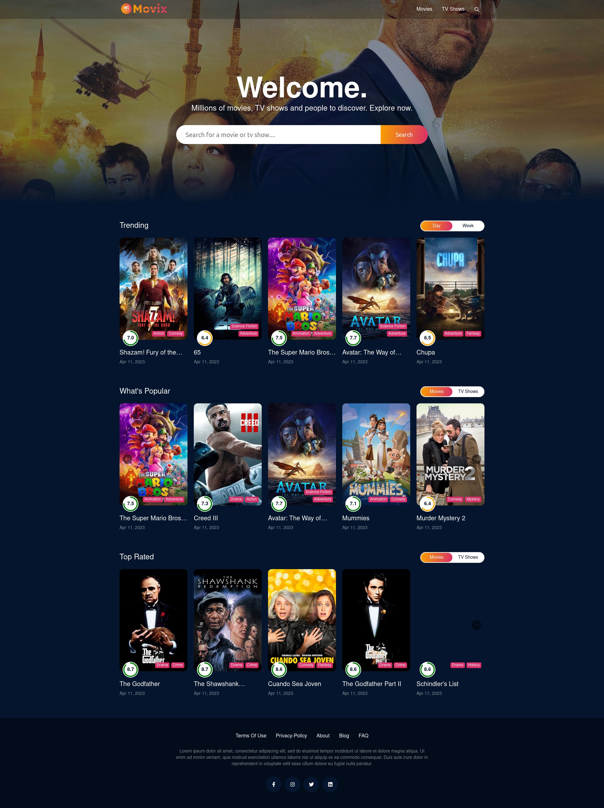
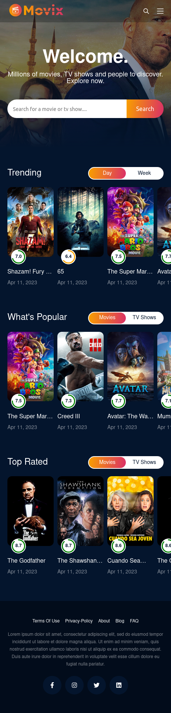
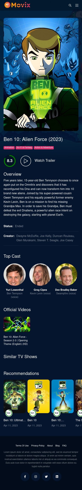

# MoviX

This is a movie website that was created using React, SCSS, and the TMDB API. The website displays a list of movies, and allows users to search for movies by title, and view more details about each movie.



## Features

- Display list of movies from the TMDB API
- Search for movies by title
- View more details about each movie, including a synopsis, release date, and rating
- Responsive design that works on mobile, tablet, and desktop devices

## Getting Started

To get started, clone this repository to your local machine:

```bash
  git clone https://github.com/csalam07/movix.git
```

Once you have cloned the repository, you can install the dependencies and start the development server:

```bash
  cd movix
  yarn
  yarn dev
```

This will start the development server and open the website in your default browser at http://localhost:5173.

## Deploying to Vercel

To deploy the website to Vercel, you can follow these steps:

1. Sign up for a Vercel account at https://vercel.com/signup.
2. Install the Vercel CLI by running npm i -g vercel.
3. Run vercel login to log in to your Vercel account.
4. Run vercel init to create a new Vercel project.
5. Follow the prompts to configure your project.
6. Run vercel --prod to deploy the website to Vercel.

## Environment Variables

To run this project, you can create a .env file in the root of the project, and set the following environment variables:

`VITE_APP_TMDB_TOKEN`=paste_here_your_tmdb_api_v4_auth

## Screenshots




